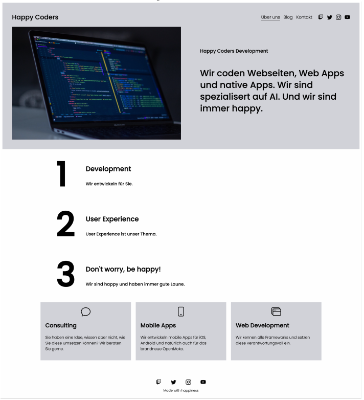
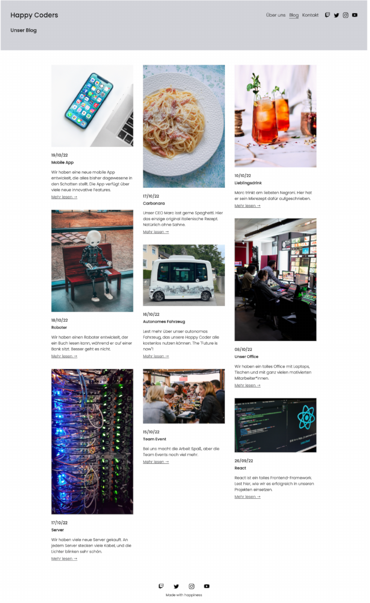
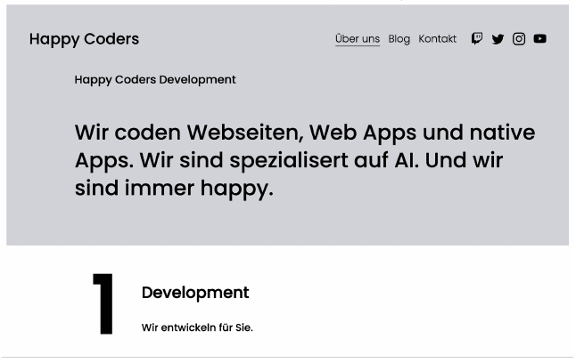
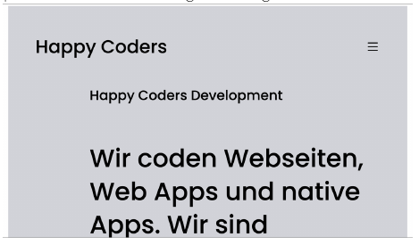
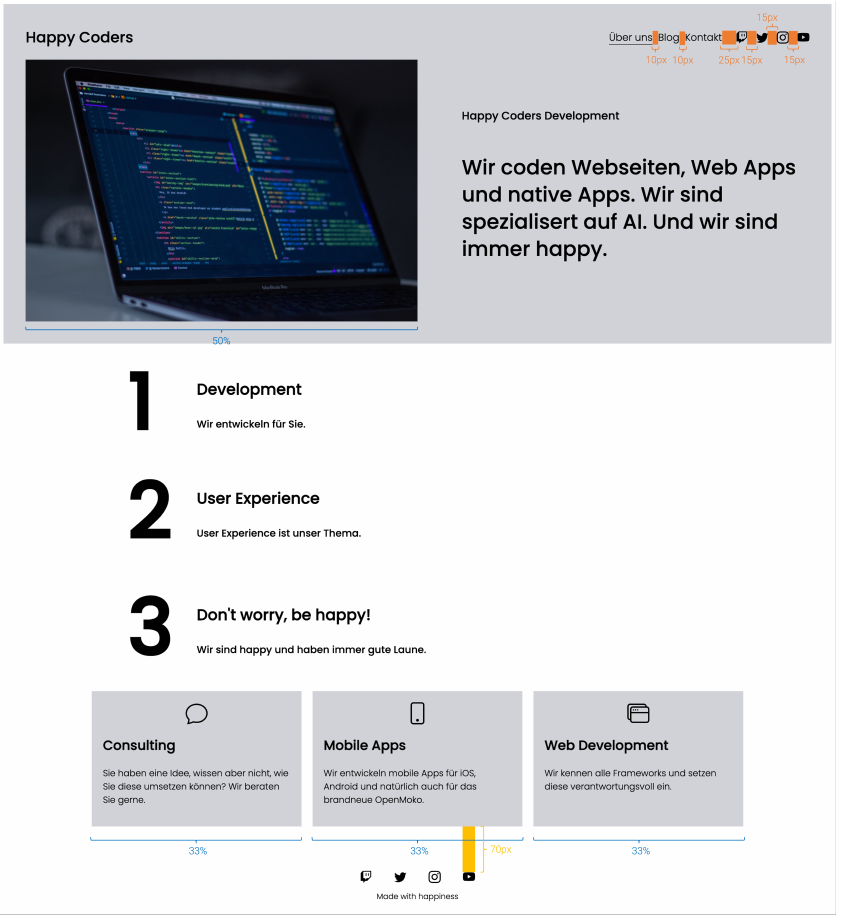
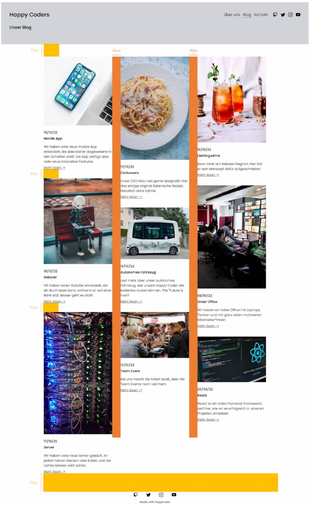

# mi-happy-coders_starter
## Studienleistung Happy Coders
In dieser Aufgabe erstellen Sie eine Homepage für die fiktive Softwareentwicklungsfirma
Happy Coders, die Webseiten und mobile Apps entwickelt.

Laden Sie sich hierfür das Starterprojekt aus GitHub classroom herunter. 
In diesem sind alle Texte und Bilder, sowie eine erste Orientierung für die allgemeine Ordnerstruktur enthalten. 
Verändern Sie diese nicht. 

Die Homepage ist responsive und besteht aus den drei Seiten
Über uns (index.html), Blog und Kontakt:
Die Seite Über uns sieht wie folgt aus:



Die Seite Blog sieht wie folgt aus:



Die Seite Kontakt existiert noch nicht, diese können Sie selbst entwerfen (Details siehe Abschnitt Kontakt weiter unten).

### Breakpoints
Die Website verfügt über zwei Breakpoints bei weniger als 1100px und weniger als 750px, an denen die Darstellung für kleinere Browser angepasst wird. 
Der erste Breakpoint bei weniger als 1100px passt die Darstellung der Über uns Seite wie folgt an (Die Seite Blog wird bei diesem Breakpoint nicht angepasst):



Der zweite Breakpoint bei weniger als 750px betrifft die Navigation auf allen Seiten und passt die Darstellung wie folgt an:



Der Button für das Menü ist dabei nur ein Icon und nicht interaktiv, d.h. es passiert nichts, wenn die User der Webseite auf das Icon klicken.
Unter dem folgenden Link finden Sie diese Bilder auch in ELO:
https://elearning.hs-regensburg.de/mod/page/view.php?id=100424&forceview=1.

### Über uns
#### Abmessungen der Abschnitte



### Sonstige Anforderungen
1. Schriftgröße der Einträge in der Navigationsleiste 18px
2. Schriftgröße der Überschrift Happy Coders Development 20px
3. Der Text darunter Wir coden Webseiten ... 37px
4. Schriftgröße der Nummerierung der Texte Development, User Experience und Don’t worry, be happy! 140px
5. Größe der Icons in den Panels im unteren Teil der Seite 40px

### Blog
#### Abmessungen der Abschnitte



Für diese Seite werden keine weiteren exakten Anforderungen angegeben, Sie müssen die Werte nicht exakt treffen.

### Kontakt
Für diese Seite Seite existiert kein Bild, Sie können diese frei gestalten, solange die folgenden Anforderungen erfüllt werden:
• Mindestens zwei zum Thema der Seite passende Bilder von
https://unsplash.com/
• Ein Bereich mit drei Spalten, die optisch wie die Spalten Consulting, Mobile Apps und Web Development der About us Seite gestaltet sind (aber mit neuen Icons und Tex- ten).
• Mindestens 4 Textabsätze (<p>).

### Tipps zur Bearbeitung
Die gesamte Website besteht aus (teils) ineinander verschachtelten Flex-Containern. 
Machen Sie sich erst mit Flexbox vertraut, bevor Sie mit der Bearbeitung beginnen, falls noch nicht geschehen!
**Erstellen Sie unbedingt zuerst eine Skizze mit allen (Flex-) Containern, aus denen die Seite besteht.**
Auch wenn sich diese im Lauf der Entwicklung verändert, haben Sie einen ersten Plan, anhand dessen Sie den HTML- und CSS-Code aufbauen können.
Beginnen Sie erst mit der responsiven Gestaltung der Website, wenn die Darstellung ohne Breakpoints passt.
Die verwendete Schriftart ist Poppins in den Schriftstärken 300 light) und 500 (medium).
Auf der Google-Fonts-Seite (https://fonts.google.com/specimen/Poppins) lässt sich
nach Auswahl der Schriftstärken der folgende Code erzeugen, den Sie im head der HTML-Dateien einbinden können:

```html
< link rel = " preconnect " href = " https :// fonts . googleapis . com " >
< link rel = " preconnect " href = " https :// fonts . gstatic . com "
crossorigin >
< link href = " https :// fonts . googleapis . com / css2 ? family = Poppins :
wght@300 ;500& display = swap " rel = " stylesheet " >
```

Achtung, der obige Code lässt sich nicht ohne Fehler per Copy and Paste aus dem pdf kopieren! 
Erzeugen Sie den Code selbst auf der Google-Fonts-Seite oder achten Sie genau auf etwaige Copy and Paste Fehler.

Der folgende Code zeigt die Verwendung von Poppins in CSS in der Schriftstärke 300 für den gesamten body:

```html
body {
font - family :font - weight :}
```

Alle verwendete Icons stammen aus der Bootstrap Iconbibliothek:
https://icons.getbootstrap.com/.
Es wurden die folgenden Icons verwendet:

Navigationsleiste
• twitch
• twitter
• instagram
• youtube
• hamburgernavicon (responsive)

Panels
• chat
• phone
• window-stack

Filtert man die Bibliothek nach den obigen Iconnamen, lässt sich der SVG-Code der Icons kopieren. 
Dieser sieht in etwa wie folgt aus:

```html
< svg xmlns = " http :// www . w3 . org /2000/ svg " width = " 16 " height = " 16 "
fill = " currentColor " ...
```

Dieser Code lässt sich direkt in ein HTML-Dokument einfügen und wird vom Browser als Bild dargestellt. 
Breite und Höhe lassen sich über die Attribute width und height anpassen.

### Weitere Hinweise

Halten Sie sich für eine möglichst gute Bewertung an die folgenden Punkte

1. Verwenden sie das CSS Flexbox Layout. Verwenden Sie kein Bootstrap und kein anderes CSS-Framework.
2. Halten Sie die Angaben (Maße, Schriftarten, etc.) aus der Abbildung und aus den Anforderungen genau ein. 
   Sind keine genauen Angaben vorhanden haben Sie etwas Spielraum in der Ausgestaltung.
3. Verwenden Sie das HTML und CSS, das wir im Kurs behandelt haben. Es ist zwar nicht streng verboten, HTML/CSS zu verwenden, das im Kurs nicht behandelt wurde, aber wenn Sie es falsch verwenden oder eine obskure stilistische Wahl treffen, oder Hacks verwenden, werden Sie möglicherweise schlechter bewertet.
4. Nutzen Sie die MDN-Dokumentation, wenn Sie CSS-Eigenschaften oder HTML-Elemente nachschlagen wollen.
5. Verwenden Sie kein JavaScript. Sie benötigen für diese Aufgabe kein JavaScript, außer Sie wollen das Beispiel kreativ erweitern...
6. Separation of Concerns: Ihr HTML sollte den Inhalt Ihrer Seite beschreiben, und Ihr CSS sollte das Aussehen Ihrer Seite beschreiben.
7. DRY - Don’t repeat yourself: Versuchen Sie, Redundanzen in ihrem CSS-File zu vermeiden, wenn es Möglichkeiten gibt, Vererbung oder spezielle Selektoren zur präzisen Definition von Stilregeln zu verwenden. 
   Gerne können Sie auch SASS verwenden.
8. Verwenden Sie beschreibende Namen, konsistente Einrückungen und befolgen Sie ansonsten eine gute Code-Hygiene, gestalten Sie Ihren Code lesbar und entfernen nicht (mehr) benötigte Elemente.
9. Verwenden Sie Git sinnvoll (d.h. regelmäßige commits mit sinnvollen commit Messages).